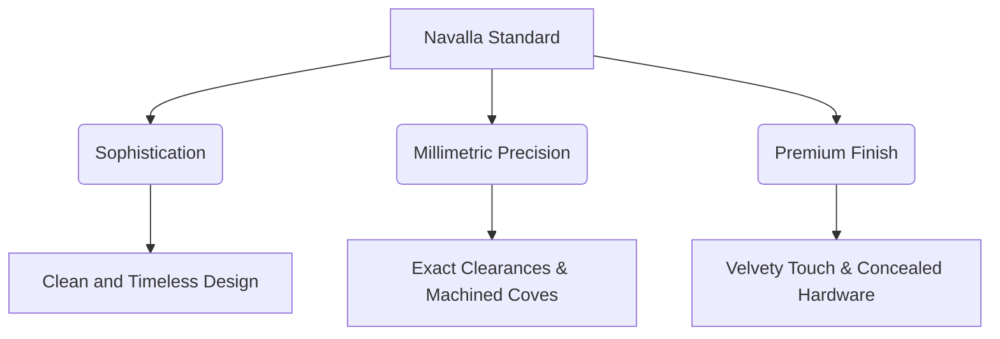

import BrandPreview from '~/components/brand-preview.astro';

At **Realizzati Móveis**, we don't just create custom furniture; we design stages for sophisticated lives. The tone of our voice and the precision of our visual signature are governed by what we call the **Navalla Standard** (Padrão Navalla).

This section defines the guidelines that elevate our technical design system to a high-luxury brand authority.

---

## 1. The "Navalla Standard" Manifesto

The **Navalla Standard** (inspired by the surgical precision of a razor and the elegance of classic naval design) is our non-negotiable commitment to perfect execution. In the luxury custom furniture market, the difference between the ordinary and the extraordinary lies in the tolerance for error. Our tolerance is zero.

### 1.1. Understated Sophistication
We avoid excessive ornamentation. At Realizzati, sophistication manifests through the nobility of materials and the symmetry of lines. Luxury doesn't scream; it reveals itself in the texture of a matte lacquer and the metallic warmth of a brushed brass profile.

### 1.2. Millimetric Precision
Every module, MDF board, and natural wood grain is aligned with geometric rigor. Before manufacturing, our in-situ laser technical measurement guarantees that the clearances of doors and drawers remain strictly symmetrical and level.

### 1.3. Premium Finish
The touch must be a sensory experience of luxury. The painting of our lacquers goes through controlled processes of polishing and curing, ensuring homogeneous surfaces without porosity or manual marks.

---

## 2. Chromatic Harmony in Practice

To ensure that Realizzati's digital and physical communication conveys this brand authority, all layouts must harmoniously balance our three main luxury tones:

1. **Dark Espresso:** The earthy dark brown tone that serves as an anchor, representing the solidity of noble woods.
2. **Sand Gold:** The refined gold inspired by brushed brass, used as a high-hierarchy highlight point or main CTA buttons.
3. **Soft Cream:** The off-white that replaces sterile white, bringing an elegant and comfortable breathing space for reading.

---

## 3. Practical Example of Application (Mockup)

Below is a high-fidelity mockup demonstrating the harmony of these visual tokens applied to a conceptual environment card. Note the *Double-Bezel* (beveled) effect on the border, the Serif typography in the title, and the dynamic interaction with micro-movement on the button.

<BrandPreview />

:::tip[Golden Rule of Application]
When implementing new interfaces, always use the subtle `Golden Muted Border` to finish panels and cards. This simulates the actual recess and beveling of fine carpentry cabinet doors.
:::
