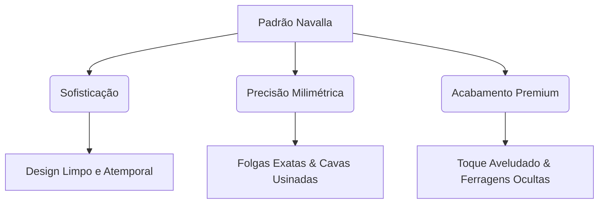

import BrandPreview from '~/components/brand-preview.astro';

A **Realizzati Móveis** não cria apenas marcenaria sob medida; nós desenvolvemos cenários para vidas sofisticadas. O tom de nossa voz e a precisão de nossa assinatura visual são regidos pelo que chamamos de **Padrão Navalla**.

Esta seção define as premissas que elevam nosso design system técnico a um nível de autoridade e narrativa de marca de alto luxo.

---

## 1. O Manifesto "Padrão Navalla"

O **Padrão Navalla** (inspirado na precisão cirúrgica de uma navalha e na elegância do design naval clássico) é o nosso compromisso inegociável com a execução perfeita. No mercado de móveis planejados de alto padrão, a diferença entre o comum e o extraordinário está na tolerância ao erro. Nossa tolerância é zero.

### 1.1. Sofisticação Discreta
Evitamos o excesso de adornos. A sofisticação na Realizzati manifesta-se através da nobreza dos materiais e da simetria das linhas. O luxo não grita; ele se revela na textura de uma lacca fosca e no calor metálico de um perfil de latão.

### 1.2. Precisão Milimétrica
Cada módulo, chapa de MDF e veio de madeira natural é alinhado com rigor geométrico. Antes da fabricação, nossa medição técnica a laser in loco garante que as folgas de portas e gavetas fiquem rigorosamente simétricas e niveladas.

### 1.3. Acabamento Premium
O toque deve ser uma experiência sensorial de luxo. A pintura de nossas laccas passa por processos controlados de polimento e cura, garantindo superfícies homogêneas, sem porosidades ou marcas manuais.

---

## 2. A Harmonia Cromática em Prática

Para garantir que a comunicação digital e física da Realizzati transmita essa autoridade de marca, todos os layouts devem equilibrar de forma harmoniosa os nossos três principais tons de luxo:

1. **Dark Espresso:** O tom de marrom escuro terroso que serve de âncora, representando a solidez das madeiras nobres.
2. **Sand Gold:** O dourado refinado inspirado no latão escovado, utilizado como ponto de destaque de alta hierarquia ou botões de conversão.
3. **Soft Cream:** O off-white que substitui o branco frio, trazendo um respiro elegante e confortável para a leitura.

---

## 3. Exemplo Prático de Aplicação (Mockup)

Abaixo está um mockup de alta fidelidade demonstrando a harmonia desses tokens visuais aplicados a um cartão conceitual de ambiente. Note o efeito *Double-Bezel* (chanfrado) na borda, a tipografia Serif no título e a interação dinâmica com micro-movimento no botão.

<BrandPreview />

:::tip[Regra de Ouro da Aplicação]
Ao implementar novas interfaces, utilize sempre a borda sutil `Golden Muted Border` para dar acabamento a painéis e cards. Isso simula o recuo e chanfrado real de portas de armários da marcenaria fina.
:::
