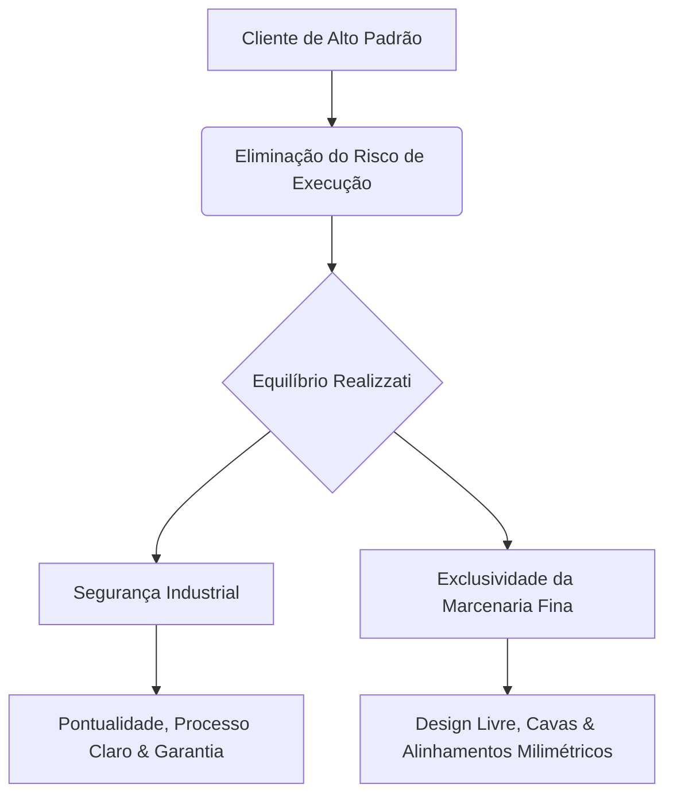

Este manual consolida a estratégia de posicionamento, tom de voz, copywriting e identidade visual da **Realizzati**. Ele serve como a diretriz mãe absoluta para garantir consistência em todos os pontos de contato da marca, projetado especificamente para captar e converter projetos de **R$ 15.000 a R$ 200.000+**.

---

# 1. Estratégia e Semiótica da Marca (Brand Schema)

## 1.1. O Alinhamento de Schema Mental
Os clientes de alto padrão não compram apenas móveis; eles compram a eliminação do risco de uma execução malfeita. Nosso posicionamento equilibra dois mundos complementares:
1. **A Segurança de uma Indústria:** Garantia de pontualidade, processos padronizados, maquinário de ponta e solidez financeira.
2. **A Exclusividade de uma Marcenaria Fina:** Liberdade total de design, detalhamento milimétrico, personalização sob medida e acabamentos manuais primorosos.

---

## 1.2. O Perfil Psicográfico do Consumidor (Target Human)

### 1.2.1. O Perfil Otimizador (Projetos de R$ 15.000 a R$ 30.000)
* **Quem é:** Proprietários de apartamentos novos ou compactos, jovens casais ou investidores de imóveis para locação.
* **Desejo Central:** Aproveitar cada centímetro quadrado do imóvel com móveis resistentes e esteticamente limpos.
* **Medo Central:** Estourar o orçamento da reforma ou receber móveis frágeis que se desgastam em poucos anos.
* **Mecanismo Psicológico de Venda:** *Alívio de Complexidade e Segurança Financeira.* Mostramos que um projeto planejado inteligente é um investimento duradouro que valoriza o imóvel.

### 1.2.2. O Perfil Esteta / Arquiteto (Projetos de R$ 100.000 a R$ 200.000+)
* **Quem é:** Clientes de alto poder aquisitivo ou os arquitetos que os representam.
* **Desejo Central:** Fidelidade absoluta ao projeto renderizado em 3D. Eles querem acabamentos nobres, ferragens ocultas e um visual imponente que comunique status e sofisticação.
* **Medo Central:** Que a marcenaria altere os alinhamentos do projeto do arquiteto por "limitações técnicas" ou que o acabamento das laccas e cavas venha com imperfeições visuais.
* **Mecanismo Psicológico de Venda:** *Status, Precisão Extrema e Credibilidade Técnica.* Mostramos que temos a competência de engenharia necessária para executar projetos de alta complexidade conceitual.

---

## 1.3. Pilares Estratégicos de Marca (Valores Inegociáveis)

### 1.3.1. Rigor Técnico e Engenharia de Detalhe
Não fazemos apenas móveis bonitos. Nós calculamos folgas, estruturas de sustentação e alinhamentos de veios de madeira para que o resultado final seja simétrico e estruturalmente indestrutível.

### 1.3.2. Transparência de Cronograma
O maior gargalo do mercado de marcenaria é o atraso. A Realizzati se posiciona com processos rastreáveis e prazos rigorosamente cumpridos.

### 1.3.3. Autonomia de Design
Diferente de franquias de planejados engessados que trabalham apenas com módulos pré-definidos, nós adaptamos a chapa de MDF ao milímetro exigido pelo projeto arquitetônico.

---

# 2. Tom de Voz e Engenharia de Crenças (Copywriting)

## 2.1. Simplicidade Premium
Evitamos termos excessivamente floreados ou promessas vagas que geram desconfiança ("o melhor", "o mais lindo"). Adotamos a clareza técnica e a sofisticação discreta, falando sobre benefícios de usabilidade e engenharia.

### 2.1.1. Dicionário de Tradução de Linguagem (VOC - Voice of Customer)

| ❌ Evitar (Jargão Genérico/Frágil) |  Preferir (Simplicidade Premium) | 🎯 Objetivo Psicológico |
| :--- | :--- | :--- |
| "Móveis de alta qualidade" | "Mobiliário com precisão estrutural e durabilidade testada" | Substitui o clichê "qualidade" por atributos mensuráveis. |
| "Ferragens alemãs importadas" | "Sistemas de amortecimento e suavidade de movimento integrados" | Foca na sensação física de luxo do uso, não em marcas aleatórias. |
| "Melhor custo-benefício" | "Investimento inteligente em valorização imobiliária" | Afasta a ideia de "barato" e ancora o projeto como um ativo. |
| "Marceneiros experientes" | "Projetistas e engenheiros de detalhamento técnico" | Eleva a percepção de competência técnica e planejamento. |
| "Temos garantia total" | "Suporte técnico estrutural de longo prazo e pós-venda ativo" | Reduz a ansiedade do pós-compra de forma profissional. |

---

## 2.2. Estrutura de Copywriting por Estágio de Consciência

### 2.2.1. Copy para Projetos de R$ 15k - R$ 30k (Estágio: Solução Aware)
* **Objetivo:** Mostrar que a Realizzati elimina a bagunça e otimiza o espaço sem cobrar o preço inflacionado de marcas de luxo tradicionais.
* **Headline:** *A inteligência de planejar cada centímetro com rigor técnico.*
* **Sub-texto:** *Otimize sua rotina com ambientes desenhados sob medida para o seu dia a dia. Estruturas robustas, acabamentos limpos e aproveitamento máximo de espaço com orçamento sob controle.*
* **Chamada para Ação (CTA):** *Enviar meu projeto para análise de otimização.*

### 2.2.2. Copy para Projetos de R$ 100k - R$ 200k+ (Estágio: Product/Objection Aware)
* **Objetivo:** Garantir ao cliente e ao arquiteto que a Realizzati executará o projeto exatamente como planejado, sem adaptações grosseiras ou perda de sofisticação.
* **Headline:** *Fidelidade milimétrica ao design do seu arquiteto.*
* **Sub-texto:** *A exatidão da execução industrial unida ao acabamento artesanal de alto padrão. Cavas usinadas, painéis com veios de madeira contínuos e alinhamento geométrico perfeito para projetos exigentes.*
* **Chamada para Ação (CTA):** *Falar com um projetista especialista em alto padrão.*

---

## 2.3. Resolução Ativa de Objeções (Objection Preemption)

* **Objeção 1: "O prazo de marcenaria sempre atrasa."**
  * *Resposta Realizzati:* "Trabalhamos com cronograma de produção integrado. Você recebe relatórios de progresso do seu projeto e o cumprimento da data de entrega é garantido em contrato."
* **Objeção 2: "E se o móvel não encaixar direito ou ficar raspando?"**
  * *Resposta Realizzati:* "Nossa equipe realiza a medição a laser in loco antes de cortar qualquer chapa de MDF. Toda peça é usinada em maquinário de precisão computadorizada (CNC), eliminando erros manuais de corte."

---

# 3. Identidade Visual e Linguagem Estética

## 3.1. A Paleta de Luxo

### 3.1.1. Dark Espresso (`#352520` | HSL: `14 25% 17%`)
* **Descrição:** Transmite a solidez da madeira nobre e a seriedade de uma empresa madura. Funciona como base para interfaces escuras.
* **Notas de Uso:** Use como a cor de fundo primária de blocos e heros escuras. Também deve ser a cor principal para todos os títulos de texto em fundos claros (`Soft Cream`).
* **Regras de Ouro (Don'ts):** 
  * *Não utilize sobre fundos cinzas ou pretos puros sem contraste adequado.*
  * *Não aplique em textos muito pequenos (menores de 12px) sobre fundos escuros, pois a legibilidade é comprometida.*

### 3.1.2. Sand Gold (`#C4A482` | HSL: `31 36% 64%`)
* **Descrição:** Lembra o tom do latão escovado, detalhes metálicos de iluminação e a areia fina. É o nosso tom de destaque e contraste premium.
* **Notas de Uso:** Dourado curado para transmitir autoridade e luxo; deve ser utilizado apenas em elementos de alta hierarquia ou interação, como botões de CTA principais, ícones de destaque e hover de links.
* **Regras de Ouro (Don'ts):**
  * *Não utilize como cor de texto em parágrafos longos, pois o contraste é baixo e prejudica a legibilidade.*
  * *Não aplique em grandes blocos sólidos de fundo, pois descaracteriza a sensação de "detalhe precioso".*

### 3.1.3. Warm Cream / Soft Cream (`#FAF8F5` | HSL: `14 25% 98%`)
* **Descrição:** Off-white luxuoso que suaviza a leitura, substituindo o branco hospitalar estéril.
* **Notas de Uso:** Cor padrão para fundos de páginas claras e cards em interfaces escuras. Excelente para dar respirabilidade ao layout.
* **Regras de Ouro (Don'ts):**
  * *Não sobreponha a textos em branco puro (`#FFFFFF`) ou cinza muito claro, pois o contraste é nulo.*
  * *Não utilize como cor de texto sobre fundos de imagem sem um overlay escuro por baixo.*

### 3.1.4. Golden Muted Border (`#DFD1C1` | HSL: `31 20% 85%`)
* **Descrição:** Tom metálico atenuado que confere elegância linear às interfaces.
* **Notas de Uso:** Exclusivo para linhas de divisão, bordas de cards (efeito Double-Bezel) e contornos finos de inputs.
* **Regras de Ouro (Don'ts):**
  * *Não utilize para textos longos ou títulos, pois o contraste baixíssimo inviabiliza a leitura.*
  * *Não use em bordas grossas (maiores de 2px); as linhas devem ser finas e discretas para simular marcenaria fina.*

### 3.1.5. Pure Dark (`#1D1311` | HSL: `14 25% 10%`)
* **Descrição:** Fundo escuro absoluto de contraste aquecido.
* **Notas de Uso:** Cor primária de fundo da página inteira no modo escuro. Fornece um contraste nobre e reduz o cansaço visual.
* **Regras de Ouro (Don'ts):**
  * *Não use preto puro (`#000000` ou `#121212`) para o modo escuro, mantendo sempre o matiz marrom quente de Pure Dark.*

---

## 3.2. Regras de Aplicação do Design System (UI/UX)
Para manter o nível de qualidade estética refinada (inspirada no projeto **Navalia**):
1. **O Efeito Double-Bezel (Chanfrado):** Todos os containers de destaque devem ter uma borda sutil com opacidade (`border-[#DFD1C1]/20`) e cantos arredondados generosos (`rounded-[2rem]`), contendo em seu interior um elemento ligeiramente menor para simular o recuo geométrico de portas de armários planejados.
2. **Botões "Button-in-Button" com Micro-movimento:** Botões de ação principais devem conter o texto alinhado à esquerda e o ícone de seta (`↗` ou `→`) envolto em uma bolha de destaque à direita, com transições físicas suaves usando `cubic-bezier(0.32, 0.72, 0, 1)`.
3. **Imagens com Gradiente de Profundidade:** Toda imagem de ambiente (como cozinhas ou closets) deve possuir um overlay gradiente escuro de baixo para cima, garantindo legibilidade total para os textos e logos aplicados por cima, evitando o contraste fraco.

---

# 4. Auditoria de Consistência (Qualidade de Marca)

Antes de publicar qualquer comunicação verbal ou interface visual da Realizzati, faça a si mesmo as seguintes perguntas:
1. **Estamos usando jargões genéricos?** Se houver termos como "qualidade garantida" ou "melhor preço", reescreva focando na exatidão técnica e valorização imobiliária.
2. **O contraste está legível?** Certifique-se de que nenhum texto em Sand Gold ou off-white esteja aplicado diretamente sobre fundos claros sem um overlay escuro de contraste.
3. **A mensagem respeita a autonomia do cliente?** Evite gatilhos de urgência agressivos ("Últimas vagas", "Sua chance acaba hoje"). Em vez disso, use CTAs baseadas em progresso ("Iniciar estudo do meu espaço").
